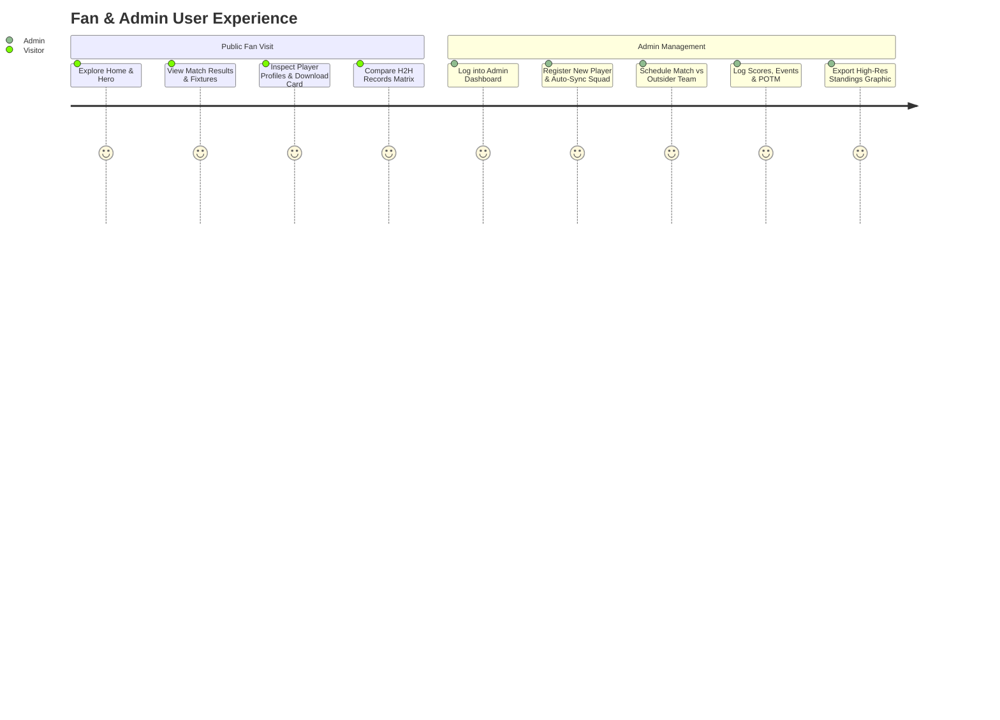

# Product Requirements Document (PRD)
## Bhai Brother Football Federation (FC BBFF)

---

## 1. Product Overview
The **FC BBFF Platform** is a web-based football management software product designed to manage club assets, squad rosters, matches, and digital graphics while giving public fans real-time access to player statistics, fixture logs, and H2H analytics.

---

## 2. Target Personas & Key User Journeys

---

## 3. Product Features & Functional Hierarchy

### 3.1 Public Engagement Portal (`/`)
- **Home Page (`/`)**: Hero section displaying crest, full club name (*Bhai Brother Football Federation*), tagline, latest match result ticker, upcoming fixtures, news highlights, and event previews.
- **Player Profiles (`/players/[slug]`)**: Displays player photo, jersey number, position badge, current city, preferred foot, height, weight, career stats grid, and downloadable official squad card.
- **Head-to-Head Comparison (`/h2h`)**: Matrix dropdown selector (Team 1 vs Team 2), match history log, win rate percentage badge, and overall internal opponent summary table.
- **Statistics Leaderboard (`/statistics`)**: Top goalscorers (Golden Boot), top playmakers (Most Assists), most POTM awards, and full squad max-to-min goal rankings.
- **Competitions & Standings (`/competitions`)**: Active season standings table, fixture schedules, and downloadable league standings card graphic.

### 3.2 Admin Console (`/admin`)
- **Player Directory**: Add/edit players with position, secondary position, jersey number, city, height, weight, preferred foot, status, and photo upload. Filter controls for search, status, and position with automatic URL query cleanup when resetting to "All Players".
- **Team & Squad Roster Modal**: Full-width (`w-[95vw] max-w-5xl`) squad roster management popup with search, role selection (Captain, Vice-Captain), and quick player assignment.
- **Match Engine**: Create match against external outsider or internal team, default primary team auto-selection, lineup builder (starting 11 & substitutes), and live/completed score logging with match events.
- **Management & Leadership**: Appoint President, Manager, Captain, Vice-Captain with auto-sync to primary core team.

---

## 4. UI/UX & Design Aesthetics System

### 4.1 Visual Design Tokens
- **Primary Background**: Deep neutral dark mode (`#0a0a0a` / `bg-neutral-950`).
- **Accent Colors**: Emerald Green (`text-emerald-400`, `bg-emerald-600`) and Gold Amber (`text-amber-400`, `bg-amber-500/10`).
- **Container Styling**: Glassmorphic frosted glass panels with subtle borders (`border-white/10 bg-white/5 backdrop-blur-md`).
- **Typography**: Clean sans-serif font (Inter font family) with high contrast uppercase headers.

### 4.2 Downloadable Graphic Cards Aesthetics
- **Card Title**: `FC BBFF` in solid white font (`text-white`) with high contrast text shadows.
- **Card Footer**: Official branding text: *Official Bhai Brother Football Federation [Card Type]*.
- **Standings Table Graphic**: Light/white container (`bg-white border-neutral-200`) with solid black text (`text-black`) for optimal contrast and print readability.
- **Card Dimensions**: Responsive card bounds with no scrollbar clipping or image truncation during 2x retina JPEG exports.
