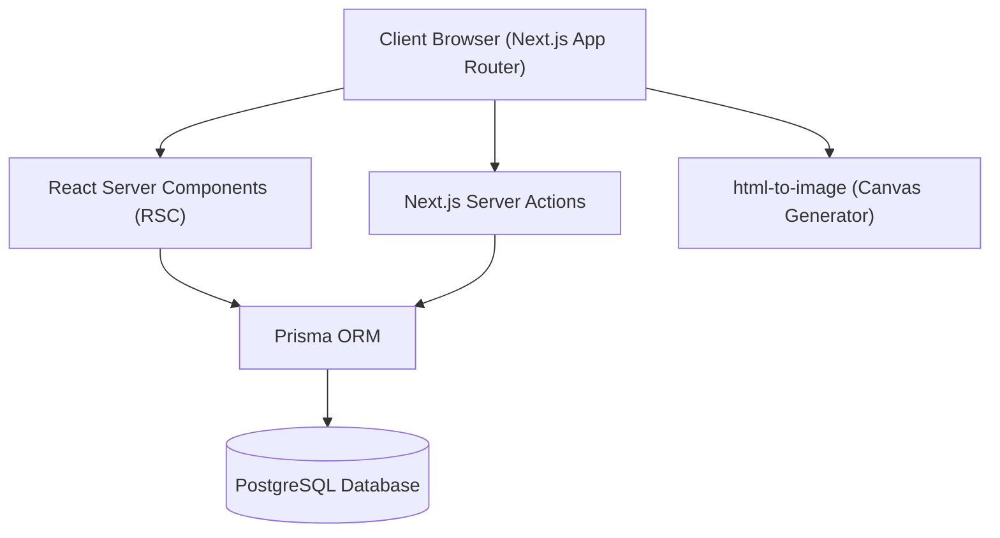

# Software Requirements Specification (SRS)
## Bhai Brother Football Federation (FC BBFF)

---

## 1. System Architecture & Tech Stack



### 1.1 Core Stack Dependencies
- **Framework**: Next.js 15+ (App Router, Server Actions, React Server Components)
- **Language**: TypeScript 5.0+ (Strict Type Checking)
- **Database Engine**: PostgreSQL
- **ORM Layer**: Prisma ORM (v5.x / v6.x)
- **Styling Framework**: Tailwind CSS
- **UI Components**: Radix UI Primitives, Lucide Icons, Sonner Notifications
- **Canvas Generation**: `html-to-image`
- **Authentication**: NextAuth.js / Auth.js with bcrypt password hashing

---

## 2. Database Schema Specification (Prisma Models)

```prisma
enum UserRole {
  SUPER_ADMIN
  ADMIN
  EDITOR
  VIEWER
}

enum PlayerPosition {
  GOALKEEPER
  DEFENDER
  MIDFIELDER
  FORWARD
}

enum MatchStatus {
  SCHEDULED
  LIVE
  COMPLETED
  POSTPONED
  CANCELLED
}

model Player {
  id                String         @id @default(uuid())
  firstName         String
  lastName          String
  slug              String         @unique
  jerseyNumber      Int?
  position          PlayerPosition
  secondaryPosition PlayerPosition?
  currentCity       String?
  dateOfBirth       DateTime?
  height            String?
  weight            String?
  preferredFoot     String?
  dateJoined        DateTime       @default(now())
  bio               String?        @db.Text
  photoUrl          String?
  status            PlayerStatus   @default(ACTIVE)
  isFeatured        Boolean        @default(false)
  
  teamPlayers       TeamPlayer[]
  matchEvents       MatchEvent[]   @relation("MatchEventPlayer")
  matchLineups      MatchLineup[]
  playerOfMatch     Match[]        @relation("PlayerOfTheMatch")
}

model Team {
  id                 String       @id @default(uuid())
  name               String
  slug               String       @unique
  logoUrl            String?
  isExternal         Boolean      @default(false)
  contactPersonName  String?
  contactPersonEmail String?
  contactPersonPhone String?
  status             TeamStatus   @default(ACTIVE)
  
  teamPlayers        TeamPlayer[]
  homeMatches        Match[]      @relation("HomeTeam")
  awayMatches        Match[]      @relation("AwayTeam")
}

model Match {
  id              String      @id @default(uuid())
  homeTeamId      String
  awayTeamId      String
  homeScore       Int?
  awayScore       Int?
  matchDate       DateTime
  venue           String?
  status          MatchStatus @default(SCHEDULED)
  competitionId  String?
  
  homeTeam        Team        @relation("HomeTeam", fields: [homeTeamId], references: [id])
  awayTeam        Team        @relation("AwayTeam", fields: [awayTeamId], references: [id])
  events          MatchEvent[]
  lineups         MatchLineup[]
}
```

---

## 3. Security & Access Control Specifications

### 3.1 Role-Based Access Control (RBAC)
- **SUPER_ADMIN**: Full database read/write, user management, audit logs, role assignments.
- **ADMIN**: Manage players, teams, matches, competitions, events, and news.
- **EDITOR**: Manage news, media, and event announcements.
- **VIEWER**: Read-only public portal access.

### 3.2 Authorization Middleware
Server Actions enforce permission verification via helper functions:
```typescript
async function requirePermission(permission: string) {
  const session = await auth();
  if (!session?.user) throw new Error("Unauthorized");
  if (!hasPermission(session.user.role, permission)) throw new Error("Insufficient permissions");
  return session;
}
```

---

## 4. Non-Functional Requirements (NFRs)

### NFR-1: Performance & Response Time
- Public server-rendered pages (RSC) shall achieve a First Contentful Paint (FCP) under 800ms.
- Database queries shall utilize Prisma indices on foreign keys (`homeTeamId`, `awayTeamId`, `playerId`, `slug`).

### NFR-2: High-Resolution Graphic Generation
- Card export helper (`exportElementAsJpeg`) shall render images at `pixelRatio: 2` (retina high-res).
- `skipFonts: true` and `cacheBust: false` options shall be configured to prevent CORS font blocking and URL load failures.

### NFR-3: SEO & Accessibility
- Every public view shall define dynamic Next.js `Metadata` with explicit title templates (`%s | FC BBFF`).
- High-contrast visual styling shall maintain Web Content Accessibility Guidelines (WCAG 2.1 AA) compliance.
